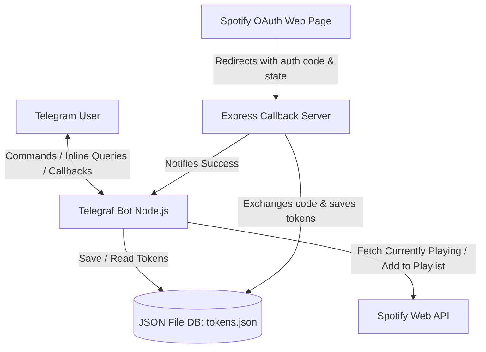

# Rocky Telegram Bot

A private Telegram bot integrated with Spotify that allows a select group of friends to share what they are currently listening to, check each other's music vibes in real time, and collaborate on a shared Spotify playlist.

---

## 🚀 Key Functionalities

1. **Interactive Menu (`/menu` or `/start`)**: 
   - Provides quick action buttons to share songs or check friends' vibes directly.
2. **Sharing Tracks (`/share`)**:
   - Fetches the user's currently playing track on Spotify.
   - Posts a rich message with the Spotify track link and an inline button to add the track to a shared playlist.
3. **Checking Vibes (`/vibes`)**:
   - Checks what your friend is listening to.
   - If you both happen to be listening to the exact same song, the bot detects this and responds with a special celebration!
4. **Inline Mode Query (`@your_bot_username `)**:
   - Allows users to invoke the bot in *any* chat (even groups the bot hasn't been added to).
   - Generates pop-up options to quickly send your currently playing track or check your friend's vibes inline.
5. **Spotify OAuth Callback Server**:
   - An integrated Express server hosts the Spotify authentication flow on `/callback`.
   - On successful authentication, users are greeted with a premium success page and notified on Telegram that they are connected.

---

## 🏗️ Architecture & Connections



### Core Technologies
- **Telegraf**: A modern Telegram Bot Framework for Node.js.
- **Spotify Web API Node**: Wrapper for interacting with Spotify's web services.
- **Express**: Runs a lightweight HTTP server to handle the OAuth redirect callback.
- **JSON File Database**: A lightweight, atomic file-writing utility in `src/db.ts` that persists tokens at `data/tokens.json`.

---

## 🔒 Security & Authorization

- **Allowed Users Registry**: The bot is configured for a private circle of friends. It restricts access via middleware in `src/index.ts` using configured Telegram IDs (e.g., `USER_1_ID` and `USER_2_ID`). All messages, callback actions, and inline queries from unauthorized IDs are silently ignored.
- **State Parameter Validation**: During the Spotify authorization flow, the Telegram User ID is passed as the `state` parameter. The redirect server validates this state and ensures that only authorized IDs can persist their tokens.
- **Token Management**: Spotify tokens are securely stored locally inside the `data/` directory. Access tokens are automatically refreshed in `src/spotify.ts` if they are about to expire (within 5 minutes of expiration).

---

## 💡 Good to Know (For Developers & Future Agents)

### ⚠️ Docker Deployment Configuration
> [!IMPORTANT]
> **Always build Docker images with `--platform linux/amd64`** when deploying to the TrueNAS SputnikX server. The development machine is an Apple Silicon Mac Mini (ARM64), but the target host platform is x86_64 (Intel/AMD).

### 💾 Persistent Storage
Ensure the `data` directory is mapped as a volume in your deployment environment (e.g., `docker-compose.yml` mounts `./data:/app/data`). Otherwise, user authentication tokens will be lost whenever the container restarts.

### ⚙️ Setting Up Inline Mode
To make inline query popups functional:
1. Open a chat with **@BotFather** on Telegram.
2. Send `/setinline`.
3. Select this bot, and provide a placeholder text (e.g., `Share music...`).
4. In the code, the handler `bot.on('inline_query', ...)` handles incoming events. 

*Note: Telegram clients aggressively cache inline results. During development, append a random letter at the end of the query (e.g., `@botname a`) to force a fresh query to the server.*

---

## 🛠️ Local Development

### 1. Requirements
- Docker and Docker Compose (or Node.js 18+ if running baremetal).

### 2. Environment Variables
Create a `.env` file based on `.env.example`:
```env
TELEGRAM_BOT_TOKEN=your_telegram_bot_token
SPOTIFY_CLIENT_ID=your_spotify_client_id
SPOTIFY_CLIENT_SECRET=your_spotify_client_secret
SPOTIFY_REDIRECT_URI=http://your_domain_or_ip:3000/callback
SPOTIFY_PLAYLIST_ID=your_shared_playlist_id
PORT=3000

# Telegram IDs of allowed users
USER_1_ID=123456789
USER_1_NAME=Alice
USER_2_ID=987654321
USER_2_NAME=Bob
```

### 3. Running with Docker Compose
```bash
# Build the image targeting SputnikX server compatibility
docker build --platform linux/amd64 -t deertraps/rocky-telegram-bot:latest .

# Run the container
docker-compose up -d
```